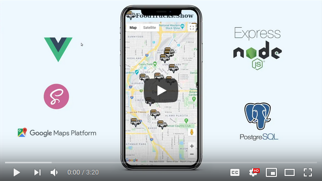
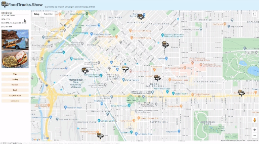
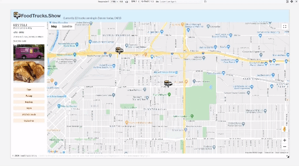

# food-trucks-show
## Overview
'FoodTrucks.Show' was my fifth coding project for Flatiron School, a proof of concept to learn more about Vue, Node, and Google Maps Platform APIs.

The app uses a Postgres db, with Node.js backend (along with Objectification for managing the trucks table).
The front-end is rendered with Vue.js (with Sass enabled), and uses the Google Maps Platform APIs.

## User Stories Goals
The idea is to provide an simple interactive map. There are plenty of food truck locator sites/apps, but most of them are on complicated to navigate, don't work well on mobile, or bulky UX-wise. Therefore, as a user, one should be able to...
- View trucks in the area on immediately on the landing page
- Filter trucks by various criteria (under development)
- Edit/add truck information (under development)
- Visit the same page that displays responsively, independent of monitor/phone brand or size

## Technical Requirements
This project was required to be...
- A Full Stack app, any languages/frameworks were permitted so long as I used 3 new (to me) technologies

## Contributor's Guide
At this time, some additional base functionality needs to be added before it makes sense to ask for contributor help. If you'd like to get in touch, you can reach me via my website, http://coreyhodge.net

## Videos

## Preview Gifs

